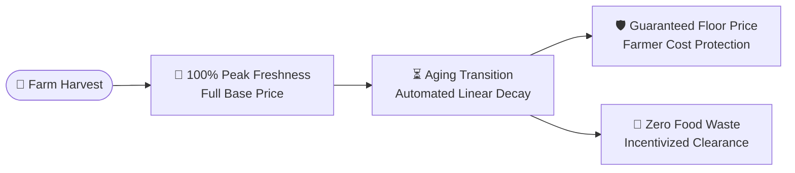
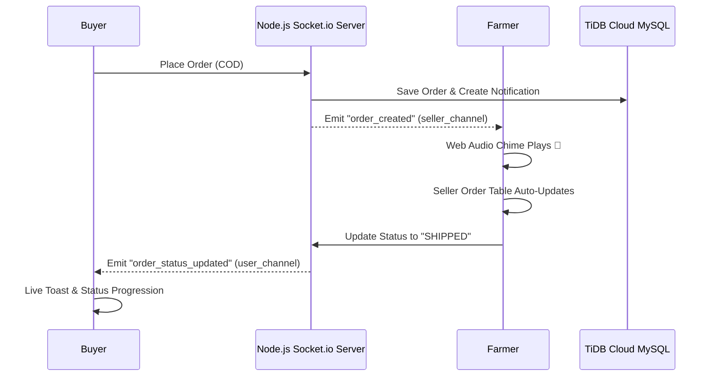

# 🌾 AgroMarket - Complete Feature Architecture & Mathematical Calculations Guide

> **A Comprehensive Technical & Functional Guide to the Features, Reverse-Pricing Algorithms, Real-Time Architecture, and Business Logic of the AgroMarket Platform.**

---

## 📌 Executive Summary

**AgroMarket** is a modern Bangladeshi agricultural marketplace that connects rural farmers directly with wholesale and retail buyers. The platform's defining innovation is its **Dynamic Aging Price Decay Algorithm (Reverse Pricing Engine)**, which automatically reduces produce prices as harvest age increases. This simultaneously incentivizes rapid clearance, eliminates post-harvest food waste, and guarantees fair floor pricing for farmers.



---

## 📑 Table of Contents
1. [Core Roles & System Capabilities](#1-core-roles--system-capabilities)
2. [Dynamic Aging Price Decay Engine (Mathematical Formula)](#2-dynamic-aging-price-decay-engine)
3. [Produce Freshness Rating & Visual Tiers](#3-produce-freshness-rating--visual-tiers)
4. [Seller Analytics & 7-Day Dynamic Sales Trajectory](#4-seller-analytics--7-day-dynamic-sales-trajectory)
5. [Buyer Savings & Lifetime Spending Engine](#5-buyer-savings--lifetime-spending-engine)
6. [Real-Time WebSocket Infrastructure (Socket.io)](#6-real-time-websocket-infrastructure)
7. [Synthesized Web Audio Notification Engine](#7-synthesized-web-audio-notification-engine)
8. [Order Lifecycle, COD & Challan Slip Invoicing](#8-order-lifecycle-cod--challan-slip-invoicing)
9. [Bilingual Localization Engine (i18n & Bengali Numerals)](#9-bilingual-localization-engine)
10. [Cloud Infrastructure & Database Architecture](#10-cloud-infrastructure--database-architecture)

---

## 1. Core Roles & System Capabilities

AgroMarket operates on a strict **Role-Based Access Control (RBAC)** model:

| Role | Access Scope | Key Capabilities |
| :--- | :--- | :--- |
| **Buyer (ক্রেতা)** | Storefront, Cart, Orders, Messages | Browse catalog with live decay timers, add to cart, negotiate via live chat, choose Cash on Delivery (COD), track order progression in real time, view savings. |
| **Seller / Farmer (কৃষক/বিক্রেতা)** | Seller Dashboard, Produce Inventory, Farm Storefront | List produce with harvest timestamp, set Base & Floor prices, track 7-day calendar sales trajectory, print Challan invoice slips, fulfill orders. |
| **Admin (প্রশাসক)** | Admin Portal, Audit Log | Verify sellers (NID & Trade license), monitor price decay radar, oversee commission, resolve disputes. |

---

## 2. Dynamic Aging Price Decay Engine

### 💡 The Problem
Perishable agricultural produce (mangoes, leafy greens, tomatoes) rapidly loses quality. Traditional markets rely on manual bargaining, resulting in up to **30-40% food spoilage** in transit or storage.

### 🧮 The Solution: Automated Database-Level Reverse Pricing
AgroMarket uses a database view (`v_active_products`) that dynamically computes the price on every query based on the **elapsed harvest time**:

```sql
TIMESTAMPDIFF(HOUR, p.harvest_date, NOW()) / 24.0 AS age_in_days
```

### 📐 Mathematical Formulation

Let:
* $t = \text{Elapsed harvest time in days} = \frac{\text{Hours since harvest}}{24}$
* $T_{\text{max}} = \text{Maximum shelf life of produce in days}$
* $P_{\text{base}} = \text{Starting / Peak base price in BDT}$
* $P_{\text{floor}} = \text{Guaranteed minimum floor price in BDT (Farmer cost protection)}$
* $\alpha = 0.10$ (10% Grace Period threshold for peak freshness)
* $\delta = 0.70$ (70% Decay slope factor)

$$\text{Age Ratio } (R) = \frac{t}{T_{\text{max}}}$$

#### Piecewise Price Function:
$$P(t) = 
\begin{cases} 
0.00 & \text{if } t \ge T_{\text{max}} \text{ (Expired)} \\
P_{\text{base}} & \text{if } R \le 0.10 \text{ (Peak Fresh Grace Period)} \\
\max \Big( P_{\text{floor}}, \; P_{\text{base}} \times \left[1 - (R - 0.10) \times 0.70\right] \Big) & \text{if } 0.10 < R < 1.00 
\end{cases}$$

### 📊 Real-World Example: Rajshahi Himsagar Mango
* **Base Price ($P_{\text{base}}$)**: ৳120 / kg
* **Floor Price ($P_{\text{floor}}$)**: ৳60 / kg
* **Shelf Life ($T_{\text{max}}$)**: 7 days

| Harvest Age ($t$) | Age Ratio ($R$) | Status | Price Calculation | Current Price | Buyer Discount |
| :--- | :--- | :--- | :--- | :--- | :--- |
| **0.5 days (12 hrs)** | $0.07 \le 0.10$ | Peak Fresh | $120$ | **৳120 / kg** | 0% (Full Price) |
| **2.0 days (48 hrs)** | $0.286$ | Aging Deal | $120 \times [1 - (0.286 - 0.10) \times 0.70]$ | **৳104.38 / kg** | **13% OFF** |
| **4.5 days (108 hrs)**| $0.643$ | Aging Deal | $120 \times [1 - (0.643 - 0.10) \times 0.70]$ | **৳74.39 / kg** | **38% OFF** |
| **6.5 days (156 hrs)**| $0.929$ | Floor Cap | Computed: ৳50.36 $\rightarrow$ Capped at $P_{\text{floor}}$ | **৳60.00 / kg** | **50% OFF (Floor)** |
| **7.2 days (172 hrs)**| $1.028 \ge 1.0$ | Expired | Zero market value | **৳0.00** | Removed from Sale |

---

## 3. Produce Freshness Rating & Visual Tiers

The user interface dynamically evaluates the produce condition using the `FreshnessBadge` component:

```javascript
const ageRatio = ageInDays / maxShelfLifeDays;
```

```
0.0 -------------- 0.15 -------------------------------- 1.0 --------------->
  [100% Peak Fresh]             [Age Discount Deal]            [Expired]
  🟢 Emerald Badge               🟠 Pulsing Amber Badge        🔴 Rose Badge
  Full farmer price              Dynamic % OFF banner          Removed from catalog
```

* **Peak Freshness ($R \le 0.15$)**: Displays **"১০০% তাজা ফসল" / "100% Peak Fresh"** with animated spin clock.
* **Aging Deal ($0.15 < R < 1.0$)**: Displays **"X% রিয়েল-টাইম ছাড়" / "X% Age Discount"** with pulsing icon.
* **Expired ($R \ge 1.0$)**: Displays **"মেয়াদউত্তীর্ণ" / "Expired"** warning.

---

## 4. Seller Analytics & 7-Day Dynamic Sales Trajectory

Located at `/seller/dashboard`, this module provides agricultural business intelligence:

### 📅 Dynamic Calendar Trajectory
Instead of fixed labels, the chart dynamically computes the **rolling 7 calendar days** ending at today's active date:

$$\text{Day Array} = [\text{Today} - 6\text{d}, \; \text{Today} - 5\text{d}, \; \dots, \; \text{Today}]$$

### 📈 Metrics Calculations:
1. **Total Farm Revenue (BDT)**:
   $$\text{Total Revenue} = \sum_{\text{delivered/confirmed orders}} \text{Order Total}$$
2. **Dynamic Y-Axis Scaling**:
   Calculates max revenue across the 7 days and adjusts grid increments dynamically:
   $$\text{Increment} = 
   \begin{cases} 
   500 & \text{if } \text{Max} \le 5,000 \\
   1,000 & \text{if } \text{Max} \le 15,000 \\
   5,000 & \text{otherwise}
   \end{cases}$$
3. **Fulfillment Ratio**:
   $$\text{Fulfillment \%} = \left( \frac{\text{Orders Delivered}}{\text{Total Orders Received}} \right) \times 100$$

---

## 5. Buyer Savings & Lifetime Spending Engine

Located at `/account/profile` and `/buyer/profile`:

### 💰 Calculations:
1. **Total Spent (মোট খরচ)**:
   $$\text{Total Spent} = \sum_{i \in \text{Orders}} \text{Order Amount}_i$$
2. **Total Orders (মোট অর্ডার)**:
   $$\text{Total Orders} = \text{Count of all placed orders}$$
3. **Total Saved Through Aging Deals (মোট সাশ্রয়)**:
   Calculates the monetary difference between the original base price and the discounted price the buyer paid:
   $$\text{Total Saved} = \sum_{i \in \text{Items}} \left( \text{Item Base Price}_i - \text{Item Purchased Price}_i \right) \times \text{Quantity}_i$$

---

## 6. Real-Time WebSocket Infrastructure

Powered by **Socket.io** on Render, connecting simultaneously to Vercel clients.



### Channel Multiplexing:
* `user_${userId}`: Direct user alerts, buyer order status progression, and direct messages.
* `seller_${sellerId}`: Farm-wide alerts (new customer orders, low stock warnings, revenue updates).
* `conv_${conversationId}`: Real-time peer-to-peer chat room between buyer and farmer.

---

## 7. Synthesized Web Audio Notification Engine

### 🎵 100% Asset-Free Web Audio Synthesis
To eliminate external MP3/WAV download failures and minimize latency, notification chimes are synthesized directly in the browser using the **Web Audio API**:

```javascript
// Synthesizes a pleasant modern chime using pure math:
const ctx = new (window.AudioContext || window.webkitAudioContext)();
const osc = ctx.createOscillator();
const gain = ctx.createGain();

// Two-tone rising harmonic chime: 587.33 Hz (D5) -> 880.00 Hz (A5)
osc.type = 'sine';
osc.frequency.setValueAtTime(587.33, ctx.currentTime);
osc.frequency.exponentialRampToValueAtTime(880.00, ctx.currentTime + 0.12);

// Smooth exponential volume decay
gain.gain.setValueAtTime(0.3, ctx.currentTime);
gain.gain.exponentialRampToValueAtTime(0.001, ctx.currentTime + 0.5);
```

---

## 8. Order Lifecycle, COD, Challan Invoicing & 1-Click Reorder Engine

### 📦 Order Lifecycle State Machine:
```
[PENDING] ➡️ [CONFIRMED] ➡️ [PACKAGING] ➡️ [IN_TRANSIT] ➡️ [DELIVERED]
    ⬇
[CANCELLED]
```

### 🔁 1-Click Repeat Buyer Reorder Engine (`/buyer/orders`):
* **Frictionless Reordering**: Repeat buyers can reorder any previous basket of agricultural produce with a single click.
* **Auto-Cart Hydration**: Iterates through all items from past orders and invokes `addToCart(product, quantity, unit)`, preserving the original quantities and measurement units (`kg` or `mon`).
* **Interactive Feedback & Direct Checkout**: Displays an animated confirmation banner showing the order number and count of re-added items, with a direct 1-click CTA button navigating to `/cart` for instant checkout.

### 🧾 Professional Agricultural Challan Slip:
* Formatted according to Bangladeshi commercial trading standards.
* Features Seller trade details, Buyer shipping address, payment method (COD / bKash / Nagad), itemized unit weights, subtotal, delivery fee, and a scannable verification QR placeholder.
* Built-in browser print styling (`@media print`) for 1-click printing on standard receipts and invoices.

---

## 9. Bilingual Localization Engine

### 🌐 Dual-Language Support (English & Bengali / বাংলা)
* Managed centrally via `LanguageContext`.
* Includes automatic numeral conversion for Bangladeshi Taka amounts and dates:
  ```javascript
  // Converts 12345.67 to ১২,৩৪৫.৬৭
  number.toLocaleString('bn-BD')
  ```
* Time-ago relative formatting (e.g., *"৫ মিনিট আগে"* vs *"5 mins ago"*).

---

## 10. Cloud Infrastructure & Database Architecture

```
                                  [ TiDB Cloud Serverless ]
                                (AWS Singapore - MySQL 8.0)
                                            ▲
                                            │ TLS Encrypted Pool
                                            ▼
[ Vercel Edge CDN ] ──── REST API / WSS ───► [ Render Web Service ]
(React 19 Frontend)                          (Node.js + Socket.io)
        │                                           │
        └────────────── Image Assets ───────────────┴────► [ Cloudinary CDN ]
```

* **Frontend**: Hosted on **Vercel** (`https://agro-market-phi.vercel.app`) with edge caching and SPA rewrites.
* **Backend API**: Hosted on **Render** (`https://agromarket-abc9.onrender.com`) with persistent WebSocket connections.
* **Cloud Database**: **TiDB Cloud Serverless** (`gateway01.ap-southeast-1.prod.aws.tidbcloud.com`) with SSL encryption.
* **Media Assets**: **Cloudinary** for image optimization and cloud storage.

---

*Document compiled for the AgroMarket Development Team, Project Stakeholders, and Technical Evaluators.*
