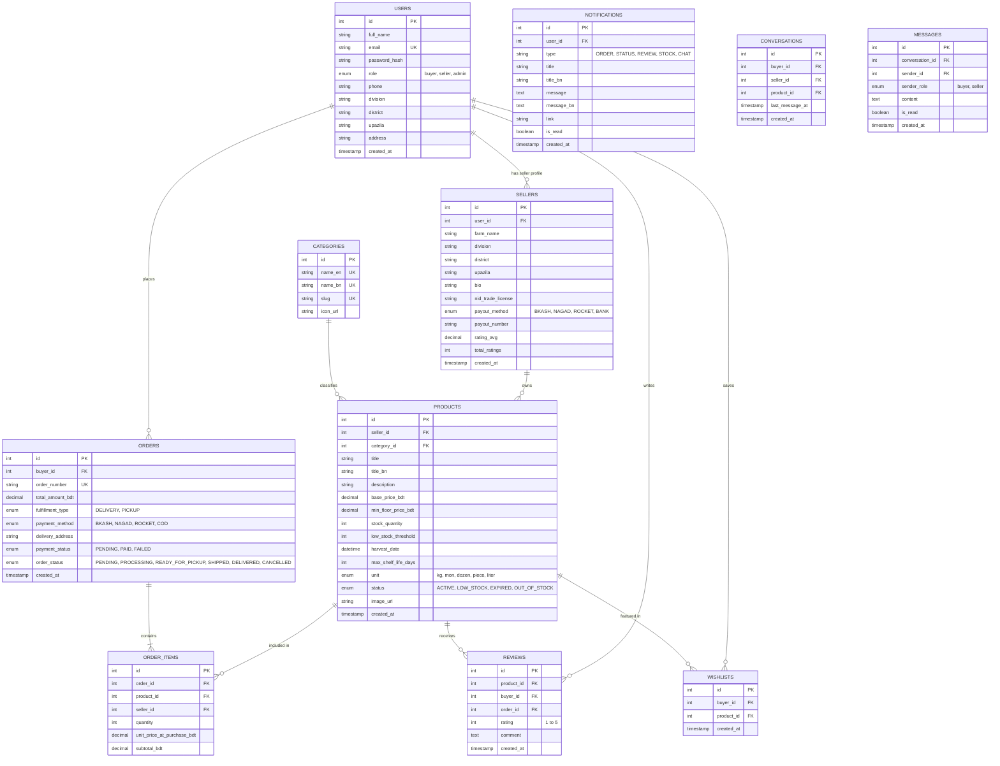
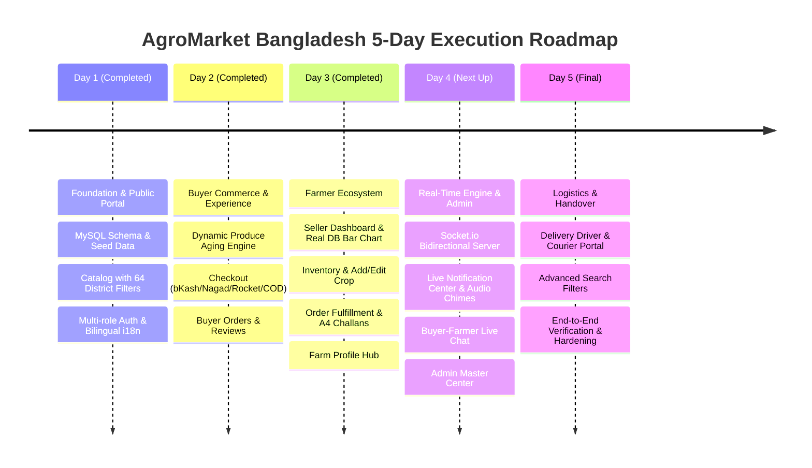

# 🌾 AgroMarket (এগ্রোমার্কেট): Complete Technical Specification & Implementation Plan

> **Project Name:** AgroMarket — Farm-Fresh, Direct to You (বাংলাদেশের কৃষকের সরাসরি বাজার)  
> **Target Market:** Bangladesh Agriculture Ecosystem (বাংলাদেশ প্রেক্ষাপট)  
> **Tech Stack:** React.js, Node.js, Express.js, Socket.io, Cloudinary, Tailwind CSS, MySQL  
> **Theme:** Clean, Modern, Eco-Green & Crisp White (#16a34a / #22c55e / #ffffff)  
> **Architecture Pattern:** Hybrid Real-Time (Socket.io) + MVC REST API (Node/Express) + Component-Driven SPA (React)

---

## 📋 Table of Contents
1. [Executive Summary & Bangladesh Agricultural Context](#1-executive-summary--bangladesh-agricultural-context)
2. [Multi-User Role & Access Matrix](#2-multi-user-role--access-matrix)
3. [Bangladesh Localized Units, Currencies & Payment Gateway Architecture](#3-bangladesh-localized-units-currencies--payment-gateway-architecture)
4. [Page Architecture & User Navigation Map](#4-page-architecture--user-navigation-map)
5. [Detailed Page-by-Page Feature Specifications](#5-detailed-page-by-page-feature-specifications)
6. [Dynamic Produce Aging Engine ("Wow Factor")](#6-dynamic-produce-aging-engine-wow-factor)
7. [Database Schema & Entity Relationship Diagram (MySQL)](#7-database-schema--entity-relationship-diagram-mysql)
8. [Express.js RESTful API Architecture](#8-expressjs-restful-api-architecture)
9. [UI/UX Design System (Green & White Theme Guide with Bangla Support)](#9-uiux-design-system-green--white-theme-guide-with-bangla-support)
10. [Step-by-Step Implementation Roadmap](#10-step-by-step-implementation-roadmap)

---

## 1. Executive Summary & Bangladesh Agricultural Context

**AgroMarket** is a digital agricultural marketplace specifically tailored for the **Bangladeshi market ecosystem**. It connects local farmers (কৃষক) across 64 districts directly with urban and rural buyers (ক্রেতা/পাইকারি ব্যবসায়ী), eliminating traditional middleman exploitation (*ফড়িয়া / আড়তদার সিন্ডিকেট*) and reducing severe post-harvest produce loss (*পচনজনিত ক্ষতি*).

### Key Highlights for Bangladesh
- **Direct Farmer-to-Buyer Sales:** Eliminates syndicate margins, giving farmers fair prices and buyers cheaper, fresher produce.
- **Bangladeshi Produce Categories:** Dedicated sections for Rice/Staples (চাল - মিনিকট/নাজিরশাইল), Mangoes (রাজশাহীর আম - হিমসাগর/ল্যাংড়া), Dinajpur Lychees (লিচু), Vegetables (বগুড়া/যশোরের সবজি), and Spices (পেঁয়াজ/রসুন).
- **Localized Units:** Quantities in **Kg (কেজি)**, **Maund / Mon (মন - 40 kg)**, **Piece (পিস/হালি)**, **Dozen (ডজন)**, and **Liter (লিটার)**.
- **Local Payment Gateways:** Seamless simulation/integration of **bKash (বিকাশ)**, **Nagad (নগদ)**, **Rocket (রকেট)**, and **Cash on Delivery (ক্যাশ অন ডেলিভারি)**.
- **Division & District Filtering:** Browse produce by origin (Dhaka, Rajshahi, Chattogram, Rangpur, Bogura, Dinajpur, Jessore, Sylhet, Barishal, Mymensingh).
- **Bilingual Interface:** Supports English & Bangla (বাংলা) localization.

```mermaid
graph TD
    A[AgroMarket Bangladesh] --> B[Buyer Portal / ক্রেতা পোর্টাল]
    A --> C[Farmer Portal / কৃষক পোর্টাল]
    A --> D[Admin Center / অ্যাডমিন সেন্টার]

    B --> B1[Division & District Produce Catalog]
    B --> B2[Dynamic Real-Time Freshness Price ৳]
    B --> B3[Cart & Checkout bKash/Nagad/COD]
    B --> B4[Order History & 1-Click Reorder]
    B --> B5[Star Ratings & Customer Reviews]
    B --> B6[Wishlist / Produce Tracker]

    C --> C1[Produce Inventory Management]
    C --> C2[Harvest Date & Max Shelf Life Setup]
    C --> C3[Low Stock Alerts (কম স্টকের সতর্কবার্তা)]
    C --> C4[Earnings Summary ৳ (মোট আয়)]
    C --> C5[Custom Farm Storefront Profile]

    D --> D1[Platform GMV & Revenue Stats ৳]
    D --> D2[Top Performing Farmers Leaderboard]
    D --> D3[District Supply Analytics]
    D --> D4[Expired Produce Audit Log]
```

---

## 2. Multi-User Role & Access Matrix

The application strictly enforces Role-Based Access Control (RBAC) via JWT middleware in Express.js.

| Feature / Module | Guest | Buyer (ক্রেতা) | Farmer (কৃষক/বিক্রেতা) | Admin (অ্যাডমিন) |
| :--- | :---: | :---: | :---: | :---: |
| Browse Catalog & Search Produce | ✅ | ✅ | ✅ | ✅ |
| Filter by Division / District / Freshness | ✅ | ✅ | ✅ | ✅ |
| View Farmer Storefront Page | ✅ | ✅ | ✅ | ✅ |
| Add to Cart & Checkout (BDT ৳) | ❌ | ✅ | ❌ | ❌ |
| Choose Delivery vs. Farm Pickup | ❌ | ✅ | ❌ | ❌ |
| Pay via bKash / Nagad / Rocket / COD | ❌ | ✅ | ❌ | ❌ |
| Leave Star Rating & Reviews | ❌ | ✅ | ❌ | ❌ |
| Wishlist / Favorite Produce | ❌ | ✅ | ❌ | ❌ |
| Order History & 1-Click Reorder | ❌ | ✅ | ❌ | ❌ |
| Create & Manage Crop Listings | ❌ | ❌ | ✅ | ❌ |
| Set Harvest Date, Stock (Mon/Kg) | ❌ | ❌ | ✅ | ❌ |
| Low-Stock Alerts (স্টক অ্যালার্ট) | ❌ | ❌ | ✅ | ❌ |
| View Earnings & Sales Summary (৳) | ❌ | ❌ | ✅ | ❌ |
| Platform-Wide Sales Analytics (৳) | ❌ | ❌ | ❌ | ✅ |
| Top Seller Leaderboard | ❌ | ❌ | ❌ | ✅ |
| User & System Management | ❌ | ❌ | ❌ | ✅ |

---

## 3. Bangladesh Localized Units, Currencies & Payment Gateway Architecture

### Currency & Quantity Units
- **Currency:** BDT — Bangladeshi Taka (`৳` / `BDT`). All prices displayed as `৳ 120 / kg` or `৳ 2,400 / mon`.
- **Quantity Units:**
  - `kg` (কেজি) — For general vegetables and fruits.
  - `mon` (মন - 40 kg) — Bulk wholesale for paddy, rice, potatoes, onions.
  - `piece` (পিস / হালি) — For watermelons, gourds, egg/lemon sets.
  - `dozen` (ডজন) — For bananas, eggs.
  - `liter` (লিটার) — For fresh cow milk, mustard oil.

### Local Payment Gateways Integration
- **bKash (বিকাশ) Payment Flow:** Sandbox simulation with PIN & OTP modal interface.
- **Nagad (নগদ) Payment Flow:** Merchant gateway checkout simulation.
- **Rocket (রকেট) Payment Flow:** Mobile banking checkout simulation.
- **Cash on Delivery (ক্যাশ অন ডেলিভারি):** Direct payment upon receiving produce from courier/farmer delivery.

---

## 4. Page Architecture & User Navigation Map

The web application consists of **15 structured pages** and **2 global real-time widgets**, organized cleanly by layout and role-based access control.

```
📁 AgroMarket Web Application Architecture
│
├── 🌐 PUBLIC PAGES
│   ├── 1. Home / Landing Page (`/`) — Featuring BD Seasons & Top Farm Divisions
│   ├── 2. Marketplace Catalog (`/products`) — Filters for Category, District, Freshness
│   ├── 3. Product Details Page (`/products/:id`) — Harvest Date, BDT Dynamic Pricing, Reviews, Chat Trigger
│   ├── 4. Seller Storefront Page (`/storefront/:sellerId`) — Farmer Profile, Farm Verification, Direct Message
│   └── 5. Authentication Page (`/login`, `/register`) — Buyer vs. Farmer Portal Sign Up
│
├── 🛒 BUYER PAGES (Protected: Role = Buyer)
│   ├── 6. Cart & Checkout Page (`/checkout`) — Delivery vs Pickup + bKash/Nagad/Rocket/COD
│   ├── 7. Buyer Dashboard & Order History (`/account/orders`) — Live Status Stepper & 1-Click Reorder
│   └── 8. Wishlist & Produce Tracker (`/account/wishlist`) — Live Price Drop Tracker
│
├── 🚜 FARMER / SELLER PAGES (Protected: Role = Seller)
│   ├── 9. Seller Dashboard & Analytics (`/seller/dashboard`) — Live Revenue ৳, Sales Bar Plot, Spoilage Prevented
│   ├── 10. Inventory Management (`/seller/inventory`) — Harvest date, Mon/Kg stock, Floor price
│   ├── 11. Add / Edit Crop Listing (`/seller/products/new`, `/seller/products/:id/edit`)
│   ├── 12. Seller Order Fulfillment (`/seller/orders`) — Cash Collection, Printable A4 Challan Invoices
│   ├── 13. Farm Profile & Settings Hub (`/seller/profile`) — Verified Badge, bKash Payouts, Geo-location
│   └── 14. Farmer Inquiries & Chat Inbox (`/seller/messages`) — Real-time buyer conversation manager
│
├── 👑 ADMIN PAGES (Protected: Role = Admin)
│   └── 15. Admin Master Center (`/admin/dashboard`) — National GMV ৳, Supply Analytics, Verification & Audit Log
│
└── ⚡ CROSS-PLATFORM REAL-TIME WIDGETS (Global Socket.io)
    ├── 🔔 Notification Bell Center (Navbar) — Real-time unread badge, synthesized audio chime, toast alerts
    └── 💬 Floating Buyer ↔ Farmer Chat Widget — Messenger-style instant messaging on produce & storefront pages
```

---

## 5. Detailed Page-by-Page Feature Specifications

### 1. Home / Landing Page (`/`)
* **Purpose:** First impression showcasing Bangladeshi farm-fresh produce, division highlights, seasonal fruits (Mango season, Winter vegetables), and dynamic produce aging.
* **Layout:** Hero header with eco-green gradient, search bar (*"Search Himsagar Mango, Miniket Rice, Bogura Potato..."*), division tags (Rajshahi, Dinajpur, Bogura, Jessore), top-rated products carousel, call-to-action for buyers and farmers.
* **UI Features:**
  * Clean hero header with search and category tags (**সবজি**, **ফল**, **চাল ও খাদ্যশস্য**, **মসলা**, **দুগ্ধ ও পোল্ট্রি**).
  * Real-time decaying prices badge preview (e.g. *"হিমসাগর আম — গতকাল তোলা — ১৫% ছাড় (৳১০০ ৳৮৫/কেজি)"*).
  * Toggle language switcher (`English` | `বাংলা`).

### 2. Marketplace Catalog (`/products`)
* **Purpose:** Main browsing portal for buyers.
* **Layout:** Sidebar filter + responsive grid of product cards.
* **Features & Tweaks Covered:**
  * **Sorting:** Sort listings by *Freshness (নবীনতম ফসল)*, *Price (কম থেকে বেশি / বেশি থেকে কম)*, *Popularity*, *Discount Level*.
  * **Filtering:** Category, Division/District (e.g., Rajshahi, Dinajpur, Bogura, Jessore, Rangpur, Sylhet), Price Slider in BDT (৳), Delivery vs. Farm Pickup.
  * **Real-time Price Indicator:** Dynamic progress bar showing freshness score (100% তাজা -> 40% ডিল প্রাইস).

### 3. Product Details Page (`/products/:id`)
* **Purpose:** Deep view of a single produce item.
* **Features Covered:**
  * High-res image gallery.
  * **Harvest Date & Aging Timer:** Exact harvest timestamp, current decay multiplier, shelf-life countdown clock.
  * Stock availability meter in **Kg** or **Mon (মন)**.
  * Farmer info widget with farm name, location district, rating score, and direct link to Seller Storefront.
  * Buyer star rating and customer reviews section.
  * Quantity selector (with unit selection `Kg` / `Mon`) and "Add to Cart" button.

### 4. Seller Storefront Page (`/storefront/:sellerId`)
* **Purpose:** Public profile page for an individual farmer/seller.
* **Features Covered:**
  * Farmer banner image, bio, farm district/upazila, farm name, and verified farmer badge (যাচাইকৃত কৃষক).
  * Overall seller star rating average (e.g., 4.9 ⭐ out of 85 reviews).
  * Complete product grid of active produce listed by this farmer.

### 5. Authentication Pages (`/login`, `/register`)
* **Purpose:** Secure multi-role user onboarding and authentication tailored for Bangladeshi buyers, farmers, and administrators.
* **Layout & Design:** Clean eco-green card interface with role-switching tab bar, bilingual field placeholders (Bangla & English), live mobile validation (+880), and clear visual distinction between user roles.

#### 🔑 5.1 Login Page Inputs (`/login`)
* **Role Selection / Context (Optional Toggle or Auto-Detected):**
  * Switcher tabs: `🛒 Buyer (ক্রেতা)` | `🚜 Farmer / Seller (কৃষক/বিক্রেতা)` | `👑 Admin (অ্যাডমিন)` (or single unified login auto-detecting user role via JWT).
* **Input Fields:**
  1. **Mobile Number / Email (মোবাইল নম্বর অথবা ইমেইল):** Standard Bangladeshi mobile format (`017xxxxxxxx` or `+88017xxxxxxxx`) or Email address.
  2. **Password (পাসওয়ার্ড):** Masked input field with a toggleable eye icon to show/hide password.
  3. **Remember Me Checkbox (মনে রাখুন):** Option to persist auth session token in LocalStorage.
  4. **Actions / Links:** "Forgot Password?" (পাসওয়ার্ড ভুলে গেছেন?) recovery trigger & link to Registration page.

#### 📝 5.2 Registration / Signup Page Inputs (`/register`)
Multi-role tab toggle at top: `🛒 Buyer Account (ক্রেতা অ্যাকাউন্ট)` vs. `🚜 Farmer / Seller Account (কৃষক/বিক্রেতা অ্যাকাউন্ট)`.

##### A. Common Base Account Fields (All Roles):
1. **Full Name (সম্পূর্ণ নাম):** Required (e.g. *Md. Rahim Uddin / মো: রহিম উদ্দিন*).
2. **Mobile Number (মোবাইল নম্বর):** Required (+880 validation, 11-digit Bangladeshi mobile string e.g. `01712345678`), used for SMS delivery notifications & bKash verification.
3. **Email Address (ইমেইল ঠিকানা):** Optional for farmers, required for buyers/admins.
4. **Password (পাসওয়ার্ড):** Minimum 6-8 characters with dynamic password strength meter.
5. **Confirm Password (পাসওয়ার্ড নিশ্চিত করুন):** Must match password field.

##### B. Role-Specific Signup Fields:

###### 🛒 1. Buyer (ক্রেতা) Registration Specific Inputs:
* **Division (বিভাগ):** Dropdown select (Dhaka, Rajshahi, Chattogram, Rangpur, Khulna, Barishal, Sylhet, Mymensingh).
* **District (জেলা):** Dynamic dropdown dependent on selected Division (e.g., Bogura, Dinajpur, Jessore, Dhaka, etc.).
* **Upazila / Thana (উপজেলা / থানা):** Text input or dropdown for granular location tracking.
* **Delivery Address (বিস্তারিত ডেলিভারি ঠিকানা):** Textarea for street address, house/holding number, road name.
* **Default Payment Preference (পছন্দনীয় পেমেন্ট মাধ্যম - Optional):** Quick select (`bKash`, `Nagad`, `Rocket`, `Cash on Delivery`).

###### 🚜 2. Farmer / Seller (কৃষক / বিক্রেতা) Registration Specific Inputs:
* **Farm / Business Name (খামার বা ব্যবসার নাম):** Required (e.g. *রাজশাহী ম্যাঙ্গো এগ্রো* / *রহিম অর্গানিক ফার্ম*).
* **Farm Division (খামারের বিভাগ):** Dropdown select (Origin location of crops).
* **Farm District (খামারের জেলা):** Dropdown select (e.g., Dinajpur, Bogura, Rajshahi, Jessore).
* **Farm Upazila / Union (খামারের উপজেলা / ইউনিয়ন):** Detailed origin for local produce pickup & courier dispatch.
* **Detailed Farm Address (খামারের বিস্তারিত ঠিকানা):** Physical location of farm or agricultural warehouse.
* **Primary Produce Category (প্রধান ফসলের ধরণ):** Multi-select tags (e.g., *চাল ও শস্য*, *ফল/আম/লিচু*, *সবজি*, *মসলা*, *দুগ্ধ ও ডিম*).
* **NID / Trade License Number (জাতীয় পরিচয়পত্র / ট্রেড লাইসেন্স নম্বর):** Optional for verification badge (`যাচাইকৃত কৃষক` badge on storefront).
* **Mobile Banking Disbursement Account (বিক্রয়ের টাকা গ্রহণের নম্বর):** Account choice (`bKash`, `Nagad`, `Rocket`, `Bank Account`) + account number for automatic payouts.

###### 👑 3. Admin Account Signup (System Restricted / Seeded):
* Admins are created internally or seeded during initialization. Required inputs: Full Name, Email, Mobile Number, Master Admin Passcode / Security Key, System Privileges Level.


### 6. Cart & Checkout Page (`/checkout`)
* **Purpose:** Seamless purchase completion in BDT.
* **Features & Tweaks Covered:**
  * Itemized shopping cart list with current dynamically adjusted real-time price in ৳.
  * **Delivery Option Switch:** Radio toggle for **🚚 Home / Courier Delivery** vs. **🚜 Farm Pickup (খামার থেকে সরাসরি সংগ্রহ)**.
  * **Bangladeshi Payment Options:**
    * 💗 **bKash (বিকাশ)**
    * 🟧 **Nagad (নগদ)**
    * 💜 **Rocket (রকেট)**
    * 💵 **Cash on Delivery (ক্যাশ অন ডেলিভারি)**
  * Order Summary: Subtotal (৳), Delivery Fee (৳), Total Amount (৳).

### 7. Buyer Dashboard & Order History (`/account/orders`)
* **Purpose:** Account hub for buyers to track past purchases and reorder quickly.
* **Features Covered:**
  * Tabbed list: Active Orders, Completed Orders, Cancelled Orders.
  * Order Cards with item status (Processing, Dispatched via Courier, Ready for Pickup, Delivered).
  * **1-Click Reorder Button (পুনরায় অর্ডার করুন):** Instantly adds previous order items to cart with updated current prices.
  * **Leave Star Rating & Review Button:** Opens review modal for delivered items.

### 8. Wishlist & Favorite Items (`/account/wishlist`)
* **Purpose:** Track preferred produce and get notified when prices drop.
* **Features Covered:**
  * Grid of saved items with price change tracking badges in BDT.

### 9. Seller Dashboard & Earnings (`/seller/dashboard`)
* **Purpose:** Control panel for farmers.
* **Features Covered:**
  * **Earnings Card (মোট আয়):** Total revenue earned in BDT (৳), gross sales, completed orders count.
  * **Low-Stock Alert Widget (কম স্টকের সতর্কবার্তা):** Highlighted banner alerting seller when crop quantity drops below threshold (e.g., $< 5$ Mon remaining).
  * **Active Listings Counter:** Breakdown of Fresh, Aging, and Expired produce.

### 10. Inventory Management (`/seller/inventory`)
* **Purpose:** Farmer central hub to monitor stock, units (`kg`, `mon`), floor prices, and dynamic decay states.
* **Features Covered:**
  * Search, category filtering, and status tabs (All, Active, Low Stock, Expired).
  * Quick stock adjuster, harvest age display, and soft-delete toggle.

### 11. Add / Edit Crop Listing (`/seller/products/new`, `/seller/products/:id/edit`)
* **Purpose:** Create and edit produce listings with agricultural parameters.
* **Features Covered:**
  * Bilingual crop naming, category select, base price (৳), minimum floor price (৳), stock quantity, and unit selector (`kg`, `mon`, `piece`, `dozen`, `liter`).
  * Precise harvest datetime picker and maximum shelf-life days configuration.

### 12. Seller Order Fulfillment (`/seller/orders`)
* **Purpose:** Manage dispatch pipeline, cash-on-delivery collection, and transport documentation.
* **Features Covered:**
  * Filter orders by status (All, Pending, Confirmed, Shipped, Delivered, Cancelled).
  * Step-by-step fulfillment status stepper (`Processing` → `Confirmed` → `Shipped` → `Delivered`).
  * Instant Cash on Delivery (COD) collection toggle with auto-delivery confirmation.
  * Printable standard A4 Delivery Challan / Invoice modal with bilingual breakdown, farm logo, and tax/fee separation.

### 13. Farm Profile & Settings Hub (`/seller/profile`)
* **Purpose:** Manage farm identity, geo-location, credentials, and digital payout options.
* **Features Covered:**
  * Dark-emerald verified partner overview banner with average ratings and farmer contact badges.
  * Bio & agricultural specialty description.
  * Verified Farmer badge verification status (`যাচাইকৃত কৃষক`) with NID/Trade License upload.
  * Mobile financial services disbursement configuration (`bKash`, `Nagad`, `Rocket`, `Bank`).

### 14. Farmer Live Inquiries & Chat Hub (`/seller/messages`)
* **Purpose:** Centralized real-time conversation inbox for farmers to manage inquiries from prospective buyers.
* **Features Covered:**
  * Sidebar conversation list with active buyer names, last messages, timestamps, and unread counters.
  * Real-time chat stream with product attachment preview, instant replies, and typing indicators.

### 15. Admin Master Center (`/admin/dashboard`)
* **Purpose:** Platform-wide oversight, national agricultural analytics, and dispute moderation.
* **Features Covered:**
  * **Platform-Wide Metrics:** National GMV (৳), platform fee revenues, total orders, active farmers & buyers.
  * **District & Division Agricultural Supply Analytics:** Visual produce distribution across Bangladesh divisions.
  * **Farmer Verification & Quality Moderation:** Review pending farmer profiles, inspect NID/Trade licenses, and grant/revoke Verified Badges (`যাচাইকৃত কৃষক`).
  * **Expired Produce & Waste Prevention Audit Log:** Audit log of crops saved from spoilage vs. expired items.
  * **Dispute & Refund Resolution:** Manage flagged orders or delivery discrepancies.

### ⚡ Cross-Platform Real-Time Modules
* **🔔 Live Notification Center (Navbar):**
  * Socket.io powered push notifications with synthesized Web Audio chimes (no external sound files required).
  * Unread counter badges, dropdown notification drawer, time-ago relative timestamps, and one-click navigation.
* **💬 Floating Buyer ↔ Farmer Chat Widget:**
  * Messenger-style dock expandable from bottom right on Product Details and Storefront pages.
  * Instant WebSocket push delivery (`socket.emit('send_message')`), bidirectional live conversation without page reload.

---

## 6. Dynamic Produce Aging Engine ("Wow Factor")

### Conceptual Mechanics for Bangladesh
Perishable produce like Bangladesh tomatoes, green chilis, milk, and mangoes spoil quickly due to weather conditions. The Dynamic Aging Engine drops prices automatically as hours/days pass since harvest time.

```
    [ Harvest Date (ফসল কাটার সময়) ]  -------->  [ Current Date (বর্তমান) ]  -------->  [ Max Shelf Life (সর্বোচ্চ স্থায়িত্ব) ]
      Base Price: ৳100 / kg                        Age Deal: ৳60 / kg                        Status: EXPIRED (পচে গেছে)
       Freshness: 100% তাজা                        Freshness: 50% ছাড়                        Status: Auto-Disabled
```

### Mathematical Formula
Let:
- $P_{\text{base}}$ = Base original price set by farmer (in BDT ৳)
- $P_{\text{floor}}$ = Minimum price floor set by farmer (prevents selling below cultivation cost)
- $T_{\text{harvest}}$ = Timestamp when crop was harvested
- $T_{\text{now}}$ = Current timestamp
- $D_{\text{age}}$ = Days elapsed since harvest = $\max\left(0, \frac{T_{\text{now}} - T_{\text{harvest}}}{86400}\right)$
- $D_{\text{shelf}}$ = Maximum shelf life in days

$$\text{Age Ratio } (R) = \frac{D_{\text{age}}}{D_{\text{shelf}}}$$

$$\text{Current Price } (P_{\text{current}}) = \begin{cases} 
P_{\text{base}} & \text{if } R \le 0.1 \text{ (First 10\% of shelf life: Peak Freshness)} \\
\max\left(P_{\text{floor}}, P_{\text{base}} \times (1 - (R - 0.1) \times 0.8)\right) & \text{if } 0.1 < R < 1.0 \\
0 & \text{if } R \ge 1.0 \text{ (EXPIRED)}
\end{cases}$$

---

## 7. Database Schema & Entity Relationship Diagram (MySQL)



### Key SQL Implementation Scripts

```sql
-- Users Table
CREATE TABLE users (
    id INT AUTO_INCREMENT PRIMARY KEY,
    full_name VARCHAR(100) NOT NULL,
    email VARCHAR(150) UNIQUE,
    password_hash VARCHAR(255) NOT NULL,
    role ENUM('buyer', 'seller', 'admin') NOT NULL DEFAULT 'buyer',
    phone VARCHAR(20) NOT NULL UNIQUE,
    division VARCHAR(50) DEFAULT 'Dhaka',
    district VARCHAR(50) DEFAULT 'Dhaka',
    upazila VARCHAR(50),
    address TEXT,
    created_at TIMESTAMP DEFAULT CURRENT_TIMESTAMP
) ENGINE=InnoDB;

-- Sellers Profile Table
CREATE TABLE sellers (
    id INT AUTO_INCREMENT PRIMARY KEY,
    user_id INT NOT NULL UNIQUE,
    farm_name VARCHAR(150) NOT NULL,
    division VARCHAR(50) NOT NULL,
    district VARCHAR(50) NOT NULL,
    upazila VARCHAR(50),
    bio TEXT,
    nid_trade_license VARCHAR(50),
    payout_method ENUM('BKASH', 'NAGAD', 'ROCKET', 'BANK') DEFAULT 'BKASH',
    payout_number VARCHAR(20),
    rating_avg DECIMAL(3,2) DEFAULT 0.00,
    total_ratings INT DEFAULT 0,
    created_at TIMESTAMP DEFAULT CURRENT_TIMESTAMP,
    FOREIGN KEY (user_id) REFERENCES users(id) ON DELETE CASCADE
) ENGINE=InnoDB;

-- Categories Table (Bilingual)
CREATE TABLE categories (
    id INT AUTO_INCREMENT PRIMARY KEY,
    name_en VARCHAR(50) NOT NULL UNIQUE,
    name_bn VARCHAR(50) NOT NULL UNIQUE,
    slug VARCHAR(50) NOT NULL UNIQUE,
    icon_url VARCHAR(255)
) ENGINE=InnoDB;

-- Products Table with Real-Time Aging Parameters
CREATE TABLE products (
    id INT AUTO_INCREMENT PRIMARY KEY,
    seller_id INT NOT NULL,
    category_id INT NOT NULL,
    title VARCHAR(150) NOT NULL,
    title_bn VARCHAR(150),
    description TEXT,
    base_price_bdt DECIMAL(10,2) NOT NULL,
    min_floor_price_bdt DECIMAL(10,2) NOT NULL,
    stock_quantity INT NOT NULL DEFAULT 0,
    low_stock_threshold INT NOT NULL DEFAULT 10,
    harvest_date DATETIME NOT NULL,
    max_shelf_life_days INT NOT NULL DEFAULT 7,
    unit ENUM('kg', 'mon', 'dozen', 'piece', 'liter') NOT NULL DEFAULT 'kg',
    status ENUM('ACTIVE', 'LOW_STOCK', 'EXPIRED', 'OUT_OF_STOCK') DEFAULT 'ACTIVE',
    image_url VARCHAR(255),
    created_at TIMESTAMP DEFAULT CURRENT_TIMESTAMP,
    FOREIGN KEY (seller_id) REFERENCES sellers(id) ON DELETE CASCADE,
    FOREIGN KEY (category_id) REFERENCES categories(id) ON DELETE RESTRICT
) ENGINE=InnoDB;

-- MySQL View for Dynamic Real-Time Calculated BDT Price
CREATE OR REPLACE VIEW v_active_products AS
SELECT 
    p.*,
    s.farm_name,
    s.division AS farm_division,
    s.district AS farm_district,
    s.rating_avg AS seller_rating,
    c.name_en AS category_name_en,
    c.name_bn AS category_name_bn,
    TIMESTAMPDIFF(HOUR, p.harvest_date, NOW()) / 24.0 AS age_in_days,
    CASE 
        WHEN TIMESTAMPDIFF(HOUR, p.harvest_date, NOW()) / 24.0 >= p.max_shelf_life_days THEN 0.00
        WHEN (TIMESTAMPDIFF(HOUR, p.harvest_date, NOW()) / 24.0) / p.max_shelf_life_days <= 0.1 THEN p.base_price_bdt
        ELSE GREATEST(
            p.min_floor_price_bdt, 
            ROUND(p.base_price_bdt * (1 - (((TIMESTAMPDIFF(HOUR, p.harvest_date, NOW()) / 24.0) / p.max_shelf_life_days) - 0.1) * 0.8), 2)
        )
    END AS current_dynamic_price_bdt,
    CASE 
        WHEN TIMESTAMPDIFF(HOUR, p.harvest_date, NOW()) / 24.0 >= p.max_shelf_life_days THEN 'EXPIRED'
        WHEN p.stock_quantity <= 0 THEN 'OUT_OF_STOCK'
        WHEN p.stock_quantity <= p.low_stock_threshold THEN 'LOW_STOCK'
        ELSE 'ACTIVE'
    END AS computed_status
FROM products p
JOIN sellers s ON p.seller_id = s.id
JOIN categories c ON p.category_id = c.id;

-- Notifications Table
CREATE TABLE notifications (
    id INT AUTO_INCREMENT PRIMARY KEY,
    user_id INT NOT NULL,
    type VARCHAR(50) NOT NULL,
    title VARCHAR(150) NOT NULL,
    title_bn VARCHAR(150),
    message TEXT NOT NULL,
    message_bn TEXT,
    link VARCHAR(255),
    is_read BOOLEAN DEFAULT FALSE,
    created_at TIMESTAMP DEFAULT CURRENT_TIMESTAMP,
    FOREIGN KEY (user_id) REFERENCES users(id) ON DELETE CASCADE
) ENGINE=InnoDB;

-- Chat Conversations Table
CREATE TABLE conversations (
    id INT AUTO_INCREMENT PRIMARY KEY,
    buyer_id INT NOT NULL,
    seller_id INT NOT NULL,
    product_id INT NULL,
    last_message_at TIMESTAMP DEFAULT CURRENT_TIMESTAMP ON UPDATE CURRENT_TIMESTAMP,
    created_at TIMESTAMP DEFAULT CURRENT_TIMESTAMP,
    FOREIGN KEY (buyer_id) REFERENCES users(id) ON DELETE CASCADE,
    FOREIGN KEY (seller_id) REFERENCES sellers(id) ON DELETE CASCADE,
    FOREIGN KEY (product_id) REFERENCES products(id) ON DELETE SET NULL
) ENGINE=InnoDB;

-- Chat Messages Table
CREATE TABLE messages (
    id INT AUTO_INCREMENT PRIMARY KEY,
    conversation_id INT NOT NULL,
    sender_id INT NOT NULL,
    sender_role ENUM('buyer', 'seller') NOT NULL,
    content TEXT NOT NULL,
    is_read BOOLEAN DEFAULT FALSE,
    created_at TIMESTAMP DEFAULT CURRENT_TIMESTAMP,
    FOREIGN KEY (conversation_id) REFERENCES conversations(id) ON DELETE CASCADE,
    FOREIGN KEY (sender_id) REFERENCES users(id) ON DELETE CASCADE
) ENGINE=InnoDB;
```

---

## 8. Express.js RESTful API Architecture

### Core API Endpoints Specification

#### 🔑 Authentication Routes (`/api/auth`)
* `POST /api/auth/register` — Register a Buyer or Farmer account with phone & district info.
* `POST /api/auth/login` — Authenticate and return JWT token + user details.
* `GET /api/auth/me` — Fetch currently authenticated user profile.

#### 🥬 Product Routes (`/api/products`)
* `GET /api/products` — Get filtered, sorted list of produce (uses calculated dynamic BDT pricing).
  * *Query params:* `sort=freshness|price_asc|price_desc`, `category`, `division`, `district`, `search`.
* `GET /api/products/:id` — Get single product details + harvest age + farmer profile + ratings.
* `POST /api/products` *(Seller only)* — Add new crop with harvest date, price floor, shelf life, and unit (`kg`/`mon`/`piece`/`dozen`/`liter`).
* `PUT /api/products/:id` *(Seller only)* — Update crop details, stock, or shelf life.
* `DELETE /api/products/:id` *(Seller/Admin)* — Delete product listing.

#### 🛒 Order Routes (`/api/orders`)
* `POST /api/orders` *(Buyer only)* — Create order (calculates BDT price snapshot, selects bKash / Nagad / Rocket / COD and Delivery vs. Farm Pickup).
* `GET /api/orders/my-orders` *(Buyer only)* — Fetch buyer's order history.
* `POST /api/orders/:id/reorder` *(Buyer only)* — 1-click reorder previous purchase items.
* `GET /api/orders/seller-orders` *(Seller only)* — Fetch incoming orders for farmer.
* `PATCH /api/orders/:id/status` *(Seller/Admin)* — Update order status (`Processing`, `Ready for Pickup`, `Dispatched`, `Delivered`).

#### ⭐ Review Routes (`/api/reviews`)
* `POST /api/reviews` *(Buyer only)* — Post star rating (1-5) and review for a purchased crop.
* `GET /api/reviews/product/:productId` — Get all buyer reviews for a specific produce item.

#### ❤️ Wishlist Routes (`/api/wishlists`)
* `POST /api/wishlists` *(Buyer only)* — Add crop to wishlist tracker.
* `GET /api/wishlists` *(Buyer only)* — Get buyer's saved wishlist produce items with real-time price change badges.
* `DELETE /api/wishlists/:productId` *(Buyer only)* — Remove item from wishlist.

#### 🚜 Seller Storefront & Dashboard (`/api/seller`)
* `GET /api/seller/storefront/:sellerId` — Public farmer storefront profile, ratings, and active produce listings.
* `GET /api/seller/dashboard` *(Seller only)* — Total earnings in ৳, sales volume, and low-stock alert warnings list.

#### 👑 Admin Master Routes (`/api/admin`)
* `GET /api/admin/metrics` *(Admin only)* — National GMV sales total in ৳, platform commission fees, active buyer & seller counts.
* `GET /api/admin/top-sellers` *(Admin only)* — Leaderboard of top-performing farmers ranked by sales & ratings.
* `GET /api/admin/supply-analytics` *(Admin only)* — Agricultural volume breakdown by Bangladesh divisions & districts.
* `GET /api/admin/expired-produce` *(Admin only)* — Audit list of automatically expired produce.
* `PATCH /api/admin/farmers/:id/verify` *(Admin only)* — Toggle verified farmer badge (`যাচাইকৃত কৃষক`) after NID/Trade license audit.

#### 🔔 Notification Routes (`/api/notifications`)
* `GET /api/notifications` *(Authenticated)* — Fetch current user's notifications sorted newest first.
* `PATCH /api/notifications/:id/read` *(Authenticated)* — Mark a specific notification as read.
* `PATCH /api/notifications/read-all` *(Authenticated)* — Mark all notifications as read for the user.

#### 💬 Chat & Messaging Routes (`/api/chat`)
* `POST /api/chat/start` *(Buyer only)* — Start or get existing conversation with a farmer for a specific product.
* `GET /api/chat/conversations` *(Authenticated)* — Fetch list of conversations for current buyer or farmer with unread count.
* `GET /api/chat/messages/:conversationId` *(Authenticated)* — Fetch message history for a conversation.
* `POST /api/chat/messages` *(Authenticated)* — Post new message (persists to MySQL + broadcasts to conversation socket room).

#### ☁️ Cloudinary Media Upload Routes (`/api/upload`)
* `POST /api/upload/produce-image` *(Seller only)* — Handles multipart image upload (via Multer), streams to Cloudinary folder `agromarket/produce`, generates optimized WebP thumbnail, and returns secure CDN URL (`secure_url`).
* `POST /api/upload/farm-banner` *(Seller only)* — Uploads farm cover banner and avatar to Cloudinary folder `agromarket/farms`.
* `POST /api/upload/review-photo` *(Buyer only)* — Uploads optional buyer review photo attachment to `agromarket/reviews`.

#### ⚡ Socket.io Real-Time Protocol Specifications
* **Connection Handshake:** Client connects with `auth: { token: JWT }` or `userId`. Joins personal room `user_${userId}` and `seller_${sellerId}` (if farmer).
* **Server-Emitted Events:**
  * `notification:new` — Emits `{ id, type, title, title_bn, message, message_bn, link, created_at }` directly to recipient room.
  * `order:created` — Emitted to `seller_${sellerId}` when a buyer checks out.
  * `order:status_updated` — Emitted to `user_${buyerId}` when farmer updates order status.
  * `chat:message_received` — Emitted to `conversation_${conversationId}` with full message payload.
* **Client-Emitted Events:**
  * `chat:join` — Joins `conversation_${conversationId}` room.
  * `chat:typing` — Emits typing status to other participant.
  * `chat:leave` — Leaves conversation room.

---

## 9. UI/UX Design System (Green & White Theme Guide with Bangla Support)

### Color Palette & Typography
- **Primary Emerald:** `#16a34a` (Tailwind emerald-600)
- **Primary Light:** `#22c55e` (Tailwind emerald-500)
- **Soft Mint Background:** `#f0fdf4` (Tailwind emerald-50)
- **Pure White Cards:** `#ffffff`
- **Bangla Font Support:** Inter & Hind Siliguri / Noto Sans Bengali (Google Fonts) for crisp Bangla & English rendering.

### Freshness Badge System
- 🟢 **তাটকা (Super Fresh 0-2 Days):** Green badge (`bg-emerald-100 text-emerald-800`).
- 🟡 **ডিজিটাল ছাড় (Aging Deal):** Amber badge (`bg-amber-100 text-amber-800`).
- 🔴 **মেয়াদউত্তীর্ণ (Expired):** Red badge (`bg-red-100 text-red-800`).

---

## 10. Step-by-Step Implementation Roadmap



### Detailed Daily Breakdown

#### ✅ Day 1: Foundation, Catalog & Authentication (Completed)
* Home Landing Page with dynamic aging deals carousel and Bangladesh seasonality.
* Catalog grid with category chips, division & district filters, price & freshness sorting.
* Multi-role authentication (Buyer, Farmer, Admin) with secure validation.
* Full English & Bangla localization (`LanguageContext`).

#### ✅ Day 2: Buyer Commerce, Transactions & Reviews (Completed)
* Product Details page with dynamic decay aging meter and time-ago formatting.
* Seller Storefront profile with verified farmer badge and listed produce.
* Cart & Checkout with Home Delivery vs. Farm Pickup, and bKash/Nagad/Rocket/COD payment simulation.
* Buyer Dashboard with order tracking stepper and 1-click reorder.
* Customer reviews submission and Wishlist price-drop tracker.

#### ✅ Day 3: Farmer / Seller Ecosystem & Fulfillment (Completed)
* Seller Dashboard with real database-driven revenue, sales bar chart (Daily vs. Monthly), and scrollable Leaderboard.
* Inventory Management and Add/Edit Crop listing forms with shelf-life and floor prices.
* Seller Order Fulfillment with Cash on Delivery (COD) payment collection and soft-delete capabilities.
* Printable standard A4 Delivery Challan / Invoice modal.
* Farm Profile & Settings Hub with dark-emerald verified partner overview.

#### 🚀 Day 4: Real-Time Engine, Live Notifications, Buyer-Farmer Chat, Cloudinary & Admin Center (Planned)
1. **Real-Time WebSocket Core (`Socket.io`)**:
   * Install `socket.io` (backend) & `socket.io-client` (frontend).
   * Connection management, user/seller room subscriptions, and auto-reconnect.
2. **Global Notification Center (Both Buyer & Farmer)**:
   * MySQL `notifications` table with read/unread tracking.
   * Header bell icon with real-time badge count (`🔴`).
   * Synthesized Web Audio API bell chime on arrival (pure code, zero external asset dependencies).
   * Notification slide-out tray with time-ago formatting and direct links.
   * Auto-triggers on Order Placement, Status Change, and Reviews.
3. **Buyer ↔ Farmer Direct Live Chat**:
   * MySQL `conversations` and `messages` tables.
   * *"Chat with Farmer"* trigger on Product Details and Storefront pages.
   * Messenger-style floating collapsible chat dock.
   * Dedicated Seller Inquiries & Chat Hub (`/seller/messages`).
   * Live message stream with instant socket push and typing indicator.
4. **Cloudinary Media & Image Upload Engine (`cloudinary` + `multer`)**:
   * Backend Cloudinary integration (`/api/upload/produce-image`, `/api/upload/farm-banner`).
   * Drag-and-drop crop photo uploader in Add/Edit Crop form (`/seller/products/new`, `/seller/products/:id/edit`) with live preview, upload progress, and automatic WebP compression.
   * Farm cover banner and verification document upload in Farm Profile (`/seller/profile`).
   * Graceful fallback: handles preset selections and fallback URLs if Cloudinary API keys are not supplied.
5. **Admin Master Center (`/admin/dashboard`)**:
   * National GMV (৳), platform fee commission, active user metrics.
   * District & Division Agricultural Supply Analytics visualization.
   * Farmer Verification & Quality Moderation Hub (NID & Trade license audit).
   * Automated Expired Produce Audit Log and Dispute Resolution.

#### 🎯 Day 5: Delivery Driver Portal, Polish, End-to-End Testing & Handover (Planned)
1. **Logistics & Delivery Driver Hub (`/driver`)**:
   * Courier/driver dispatch list across districts.
   * Pickup confirmation from farm and delivery handover with COD collection check.
2. **Advanced Catalog Search & Discovery Refinement**:
   * Multi-district and price-range sliders, active freshness filter chips.
   * Dynamic price decay live updates across active browser tabs without reload.
3. **Comprehensive End-to-End System Testing**:
   * Full multi-role simulation: Farmer lists crop -> Buyer chats -> Buyer orders -> Farmer chimes & dispatches -> Driver delivers -> Buyer reviews.
   * Rigorous validation of security, input sanitization, and responsive styling.
4. **Final Documentation & Summaries**:
   * Compile `work_days/Day_4_Summary.md` and `work_days/Day_5_Summary.md`.
   * Final production build check (`npm run build`).

---
*Tailored specifically for Bangladesh Agriculture Ecosystem.*

