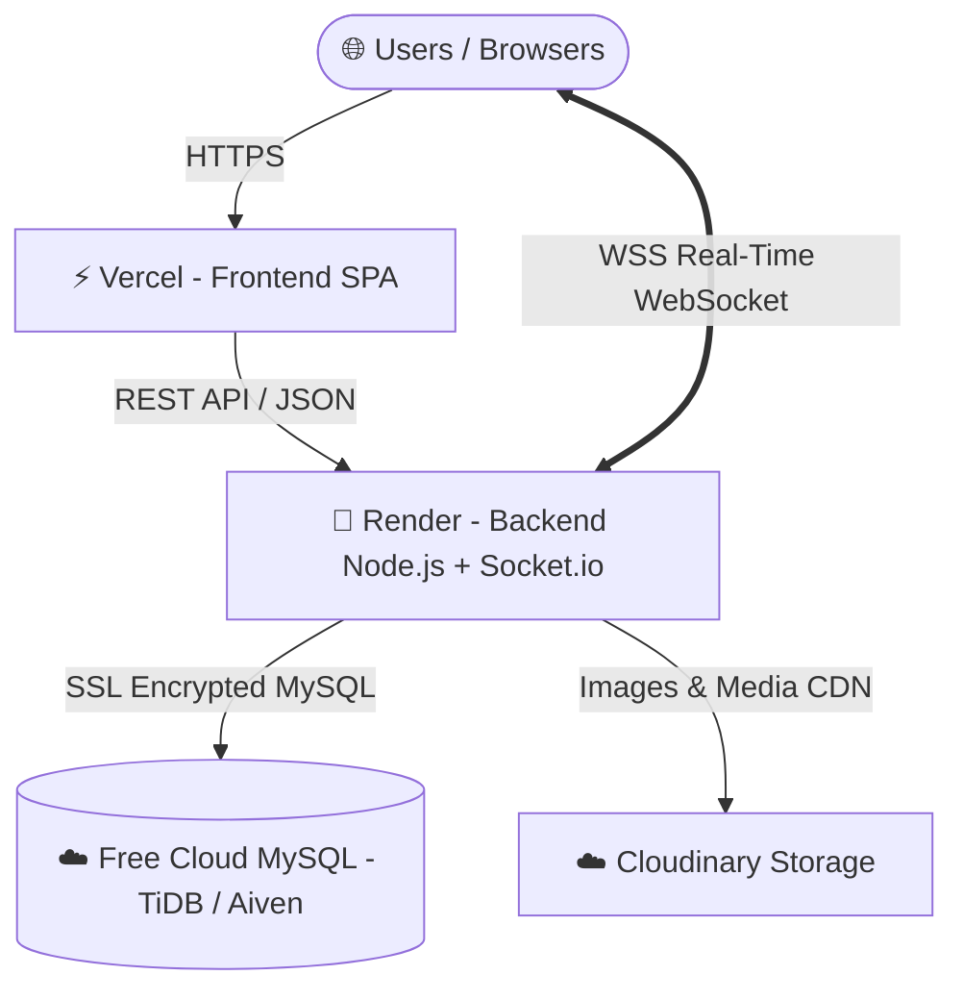

# 🚀 AgroMarket - Day 5 Deployment Guide & Architecture

**Date:** September 12, 2026  
**Status:** In Progress / Ready for Cloud Setup  

---

## 🏗️ 1. Deployment Architecture Blueprint

To ensure AgroMarket runs 24/7 with zero cost and 100% feature fidelity (including real-time Socket.io chat & notifications), the project uses this modern cloud architecture:



### Why this architecture?
1. **Frontend on Vercel**: Instant global CDN edge caching, automatic build optimizations, and zero downtime. Wildcard SPA routing is pre-configured in `frontend/vercel.json`.
2. **Backend on Render**: Unlike Vercel Serverless (which shuts down persistent connections), Render runs persistent Node.js servers, allowing **Socket.io WebSockets** to stay alive 24/7 for instant notifications and farmer-buyer messaging.
3. **Cloud MySQL (TiDB Cloud or Aiven.io)**: Replaces local `localhost:3306` with a free, secure, high-availability cloud database reachable from both Render and your local machine.

---

## 🛠️ 2. What Code Preparations Are Already Done

All code adjustments are already made and tested:
1. ✅ **Central API Configuration**: Created `frontend/src/config/api.js` which dynamically switches between `http://localhost:5000` (in development) and `import.meta.env.VITE_API_URL` (in production).
2. ✅ **Unified Endpoints**: Removed all hardcoded `http://localhost:5000` from every component and page (including `Wishlist.jsx`, `BuyerOrders.jsx`, `Messages.jsx`, `ChatModal.jsx`, `AdminDashboard.jsx`, etc.).
3. ✅ **SPA Routing on Vercel**: Added `frontend/vercel.json` with wildcard rewrite to `/index.html` to prevent 404 errors on page refresh.
4. ✅ **Cloud SSL Database Support**: Updated `backend/config/db.js` and `backend/scripts/initDb.js` to automatically negotiate SSL connections when `DB_SSL=true`.
5. ✅ **Production Build Verified**: Ran `npm run build` in `frontend` with zero errors.

---

## 📋 3. Step-by-Step Instructions: What Help You Can Provide

To deploy the website live, follow these 3 simple steps:

---

### Step A: Create a Free Cloud MySQL Database (5 minutes)

Choose either **TiDB Cloud (Recommended - Free Serverless)** or **Aiven.io**:

#### Option 1: TiDB Cloud (Serverless - 100% Free, No Credit Card)
1. Go to [https://tidbcloud.com](https://tidbcloud.com) and Sign Up (or log in with Google/GitHub).
2. Click **Create Cluster** -> Select **Serverless** (Free 5GB).
3. Name your cluster (e.g., `agromarket-db`) and select a nearby region (e.g., `Singapore` or `Mumbai` for Bangladesh latency).
4. Click **Create**.
5. Once created, click **Connect** on the dashboard.
6. Note down the credentials:
   - **Host**: (e.g. `gateway01.ap-southeast-1.prod.aws.tidbcloud.com`)
   - **Port**: `4000` (or `3306`)
   - **User**: (e.g. `xxxx.root`)
   - **Password**: (Your generated password)
   - **Database**: `test` or create `agromarket`

*(Alternatively, you can use [Aiven.io](https://aiven.io) Free MySQL or [Railway.app](https://railway.app)).*

#### Initialize the Cloud Database with AgroMarket Tables & Seed Data:
Once you have the cloud database credentials, you can populate all tables and sample Bangladeshi products in one command:
```powershell
# In backend folder, test connection and initialize:
$env:DB_HOST="your-cloud-host"
$env:DB_PORT="4000" # or 3306
$env:DB_USER="your-cloud-user"
$env:DB_PASSWORD="your-cloud-password"
$env:DB_NAME="agromarket" # or your cloud db name
$env:DB_SSL="true"
npm run init-db
```

---

### Step B: Deploy Backend to Render (5 minutes)

1. Go to [https://render.com](https://render.com) and log in with your GitHub account.
2. Click **New +** -> **Web Service**.
3. Select your repository: `AgroMarket`.
4. Configure the Web Service:
   - **Name**: `agromarket-backend`
   - **Region**: Singapore (fastest for BD)
   - **Branch**: `main` (or your deployment branch)
   - **Root Directory**: `backend`
   - **Runtime**: `Node`
   - **Build Command**: `npm install`
   - **Start Command**: `npm start`
   - **Plan**: `Free`
5. Scroll down to **Environment Variables** and add the following:
   | Key | Value |
   |---|---|
   | `PORT` | `5000` |
   | `DB_HOST` | *(Cloud DB Host from Step A)* |
   | `DB_PORT` | *(Cloud DB Port from Step A, e.g. 4000 or 3306)* |
   | `DB_USER` | *(Cloud DB User from Step A)* |
   | `DB_PASSWORD` | *(Cloud DB Password from Step A)* |
   | `DB_NAME` | *(Cloud DB Name, e.g. agromarket)* |
   | `DB_SSL` | `true` |
   | `JWT_SECRET` | `agromarket_bangladesh_secret_key_2026` |
   | `CLOUDINARY_CLOUD_NAME` | `dnlvg4ato` |
   | `CLOUDINARY_API_KEY` | `284712629524241` |
   | `CLOUDINARY_API_SECRET` | `5UV1_zLk0yZmemssNuOfkP4r91c` |
6. Click **Create Web Service**.
7. Wait 2-3 minutes. Once it says **Live**, copy your Render URL:
   - Example: `https://agromarket-backend.onrender.com`
   - You can test it by opening `https://agromarket-backend.onrender.com/api/health` in your browser.

---

### Step C: Deploy Frontend to Vercel (3 minutes)

1. Go to [https://vercel.com](https://vercel.com) and log in with GitHub.
2. Click **Add New...** -> **Project**.
3. Import the `AgroMarket` repository.
4. Configure the project:
   - **Framework Preset**: `Vite`
   - **Root Directory**: Click *Edit* and select `frontend`
   - **Build Command**: `npm run build`
   - **Output Directory**: `dist`
5. Under **Environment Variables**, add:
   | Key | Value |
   |---|---|
   | `VITE_API_URL` | *(Your Render Backend URL from Step B, e.g. `https://agromarket-backend.onrender.com`)* |
6. Click **Deploy**.
7. In ~60 seconds, your site will be live on Vercel with a custom `.vercel.app` URL! 🎉

---

## 🔒 4. Git Reminder

Remember our git workflow rule:
- Commit and push your changes on your working branch:
  ```bash
  git add .
  git commit -m "chore: prepare frontend and backend for Vercel and Render deployment"
  git push origin redowan
  ```
- Merge to `dev` and then `main` when ready to trigger Render and Vercel builds!
